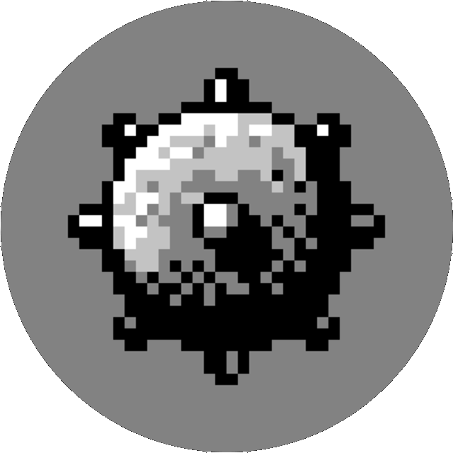
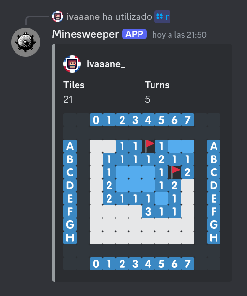

  
  <h3>Minesweeper Bot</h3>
  
💥 Play Minesweeper from Discord! 💥

---

#### Table of Contents

- [About ](#about-)
- [Usage ](#usage-)
  - [How to play ](#how-to-play-)
- [Contributing ](#contributing-)
- [Acknowledgments ](#acknowledgments-)

## About 

  

 

Play the classic Minesweeper game on your server with this Discord bot! You can control the game
with turn-based commands just as the original, play in parallel with your friends and try to get
the biggest score. Featuring an 8×8 procedurally generated board with 10 mines to discover and evade.

## Usage 

**[To add this bot to your server, click this link]().**

> [!WARNING]
> **Currently, the bot isn't hosted, so it can't be used**. If you know how to setup a bot, feel free to use the source code to set the bot by yourself.

### How to play 

The provided instructions will teach you how to interact with this bot. If you don't know how to play vanilla
Minesweeper, I recommend [this article](https://minesweepergame.com/strategy/how-to-play-minesweeper.php).

* Start a new game with the `/start` command. The GUI is composed of the board, displayed with emojis,
the left tiles counter, the turn counter, and the name of the user.

* Reveal cells with `/r <row> <column>`. You'll need to provide the coordinates of your cell: they're
displayed in the border of the board, the rows being represented with letters and columns with numbers.
For example, `/r a 0` will reveal the cell in the top left side.

* Your first reveal will always be in an empty cell for safety.

* Same as `/r`, you can place flags with `/f <row> <column>`. Tip: if a number cell has as many flags around
its 8 touching cells as the number displays, you can *reveal the number cell* to automatically reveal the
remaining cells.

* The game advances one turn after each action. If you win or lose, a notification will display.

* You can always cancel your game with `/cancel`.

Use `/help` to view the instructions from the server.

## Contributing 

If you want to make this project better ~~than what I could ever do~~, contributions are always welcome!

1. Fork the repository and clone it. `git clone https://github.com/YOUR-USERNAME/minesweeper-bot`
2. Install dependencies. `pip install -r requirements.txt`
3. Make a new branch and work on it. `git checkout -b new-feature`
4. Commit the changes. `git commit -m "Added the Thing."`
5. Push the branch. `git push origin new-feature`
6. Open a pull request.

## Acknowledgments 

| Link | Contribution |
|---|---|
| [Discord.py](https://discordpy.readthedocs.io/en/stable/) | Framework |
| [Create Your Own Discord Bot in Python 3.10](https://www.youtube.com/watch?v=hoDLj0IzZMU) | Tutorial |
| [Best README Template](https://github.com/othneildrew/Best-README-Template) | Template |
| [Robert Donner's original Minesweeper](https://archive.org/details/win3_Mineswee) | Original game |
